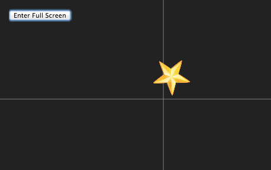

# eyetribe-client-demo-star

A demo application for [the Eye Tribe Node.js client](https://github.com/axelpale/tet-node-client). Created with [socket.io](http://socket.io/), [express.js](http://expressjs.com/) and [eyetribe-client](https://github.com/axelpale/tet-node-client).

# Installation

 - Install the Eye Tribe Tracker server
 - Run `$ npm install`

# Run

 - Start the Eye Tribe Tracker server
 - Calibrate the Tracker
 - Run `$ npm start`
 - Browse to [localhost:8888](http://localhost:8888)
